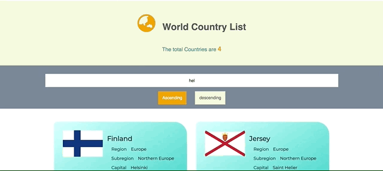
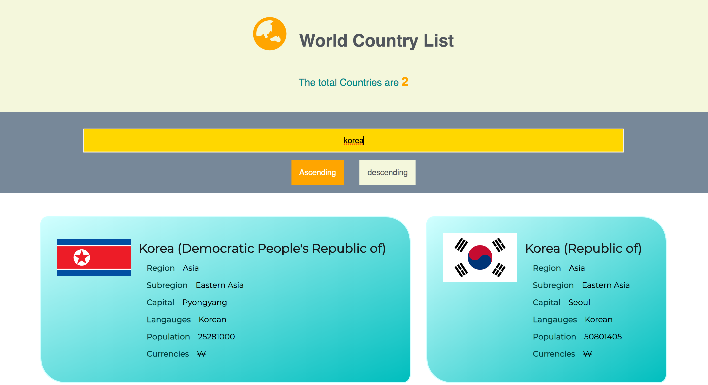
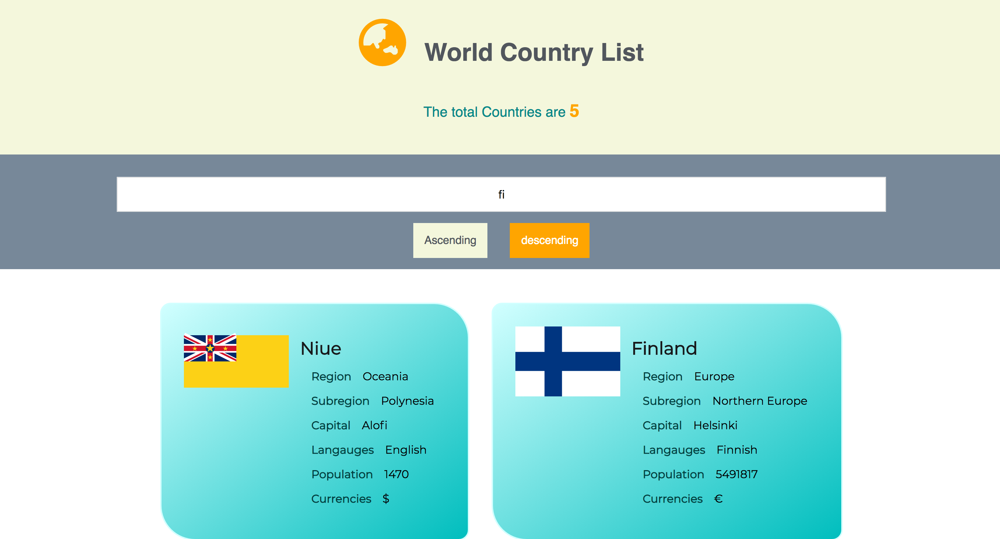

# Search & Sort data about country 

### 1. Introduction 
Users can search country's information(by name, capital, population, region, subregion, languages, currencies, flag)

and users can sort the info in ascending/descending order.

### 2. Features 

* Fetch data from URL
URL : https://restcountries.eu/rest/v2/all"
* Extract the necessary data from JSON and store it 
* Search data by any word in data value 
* Sort the data in ascending/descending order
* Display the result(searched, sorted) data 

### 3. Demo 

* Search countries

* Sort countries 

